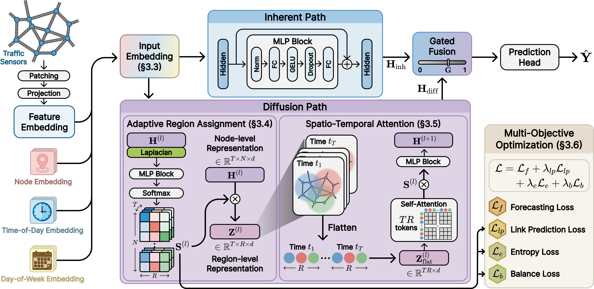

# STAAR: Spatio-Temporal Attention over Adaptive Regions for Traffic Forecasting

This repository is the official implementation of our **CIKM 2026** paper, **"STAAR: Spatio-Temporal Attention over Adaptive Regions for Traffic Forecasting"**.

**Paper status:** Accepted at CIKM 2026.

## Overview

STAAR is designed for scalable large-scale traffic forecasting. Instead of relying on expensive node-level attention over all sensor pairs, STAAR builds adaptive soft traffic regions and performs spatio-temporal attention over region tokens.

The model consists of three main components:

* **Inherent Path:** models node-specific temporal patterns with MLP blocks.
* **Diffusion Path:** models traffic propagation through adaptive region assignment and region-level spatio-temporal attention.
* **Gated Fusion:** combines node-specific inherent signals and region-level diffusion signals before prediction.

Adaptive region assignment uses traffic states and graph-topological information, including Laplacian positional embeddings, to assign each node to multiple regions with normalized weights. The assignment is regularized with link prediction, entropy, and balance losses.

## Overall Architecture



## Framework

This project is developed based on the [BasicTS](https://github.com/GestaltCogTeam/BasicTS) framework. The training pipeline, dataset interface, metrics, scalers, callbacks, and runner are inherited from BasicTS, while the STAAR model and experiment configurations are implemented in this repository.

Key implementation files:

* `src/basicts/models/STAAR/arch/staar_arch.py`: STAAR architecture
* `src/basicts/models/STAAR/config/staar_config.py`: STAAR model configuration
* `src/train.py`: training entry point
* `configs/*.json`: dataset-specific experiment configurations

## Installation

Install PyTorch for your CUDA environment first, then install the remaining dependencies:

```bash
pip install -r requirements.txt
```

## Datasets

The experiments use the LargeST traffic forecasting datasets provided by the BasicTS framework. Download the preprocessed BasicTS datasets from [Google Drive](https://drive.google.com/file/d/1m8jh1z4VNMgQ49DRwywyvYYgs3G5WBsB/view?usp=sharing).

| Dataset | Config             | #Nodes |
| :------ | :----------------- | -----: |
| SD      | `configs/SD.json`  |    716 |
| GBA     | `configs/GBA.json` |  2,352 |
| GLA     | `configs/GLA.json` |  3,834 |
| CA      | `configs/CA.json`  |  8,600 |

Place the datasets under the `datasets` directory in the working directory:

```text
./datasets
```

Each dataset should follow the BasicTS dataset format under its dataset name, such as `datasets/SD`, `datasets/GBA`, `datasets/GLA`, and `datasets/CA`.

## Training

Run STAAR on the SD dataset with:

```bash
python src/train.py --cfg configs/SD.json --gpus 0
```

For other datasets, only change the JSON config file name:

```bash
python src/train.py --cfg configs/GBA.json --gpus 0
python src/train.py --cfg configs/GLA.json --gpus 0
python src/train.py --cfg configs/CA.json --gpus 0
```

The shared training settings are defined in `configs/default.json`, and each dataset-specific JSON file overrides dataset name, number of nodes, number of adaptive regions, Laplacian positional embedding size, checkpoint path, and batch size when needed.

## Evaluation

By default, the BasicTS runner evaluates the model after training. The evaluation metrics are:

* MAE
* RMSE
* MAPE

Evaluation horizons are set to 3, 6, and 12 steps in `configs/default.json`.

## Citation

Citation information will be updated once the CIKM 2026 proceedings are available.
